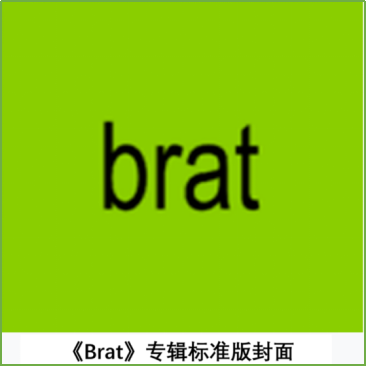
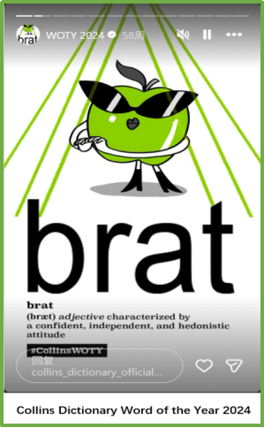

# The History of Brat

## The Earliest Records

The origin of brat remains uncertain. Nineteenth-century etymologists such as Wedgwood, E. Müller, and Skeat proposed that the word may once have referred to a coarse garment or rag. Editors of the [Oxford English Dictionary](https://www.oed.com), however, note that no historical evidence confirms a semantic connection between "cloth" and the earliest attested sense meaning "child."[1]

The oldest known record of the "cloth" sense appears in Old English, where bratt referred to an outer garment, often rough or makeshift. An example from the [*Lindisfarne Gospels*](https://en.wikipedia.org/wiki/Lindisfarne_Gospels) illustrates this early use:[2] At this stage, bratt simply denoted a garment and carried no association with children or behavior.

| Ðæm | seðe | wil | cyrtel | ðin | to | niomanne | forlet | eac | hrægl | vel | hæcla | vel | bratt |
|-----|------|-----|--------|-----|----|----------|--------|-----|-------|-----|-------|-----|-------|
| DAT | REL | want.PRS | tunic | 2SG.POSS | to | take.INF | allow.PRS | also | garment | or | cloak | or | rough cloak |

> Translation: To the one who wants to take your tunic, allow also a garment, or a cloak, or a rough outer garment.
>
> **Source:** *Lindisfarne Gospels*, Matthew 5:40

---

## The Emergence of the "Child" Sense

The meaning "child" appeared much later. The earliest known instance dates to 1557:[3]

> **Yong brats, a trouble: none at all, a maym it seems to bee.**
>
> Translation: Young children are no trouble at all; rather, they seem to be a burden or injury.
>
> **Source:** *Tottel's miscellany (Songes and sonettes, written by the ryght honorable Lorde Henry Haward late Earle of Surrey, and other)* | 1557

In this context, brat referred to a child, typically one seen as troublesome. Although sixteenth- and seventeenth-century examples sometimes lack strong contempt, the word frequently implied insignificance. Expressions such as beggar's brat were common and helped establish a derogatory tone that eventually became dominant in modern English. Over time, brat settled into its familiar negative meaning: a badly behaved or spoiled child. It shifted from a descriptive term to an evaluative one, used primarily to express disapproval of behaviors rather than simply to indicate age, as in this example:[4]

> **Repulsed in her appeal for mercy like a beggar's brat.**
>
> **Source:** W. H. Dixon, *Royal Windsor* vol. II. vi. 65 | 1879

Meanwhile a figurative extension also developed. By the late seventeenth century, brat could signify an offspring or product, as in Ralph Cudworth's 1678 phrase "An Ignoble and Bastardly Brat of Fear".[5] This metaphorical use widened the word's semantic range while keeping its negative undertones.

---

## Later Extensions and Socially Specialized Uses

As the "child" meaning became more widespread, brat underwent new extensions linked to social identity. A notable development was the use of compounds such as army brat or Hollywood brat, which referred to children raised within particular professional cultures. In these cases, the meaning did not necessarily imply misbehavior but instead highlighted shared experiences shaped by mobility, hierarchy, or industry norms.

The word also took on several minor or specialized senses, including:

- names for certain fish species (e.g., turbot or bret),[6]
- a thin layer of pyritic or calcareous material in mining,[7]
- a U.S. abbreviation for bratwurst.[8]

These uses did not influence the main semantic pathway of brat, but they show the term's adaptability in technical and regional contexts.

---

## A Pop-Culture Catalyst: Charli XCX's *Brat* (2024)

In the early 2020s, brat entered a new phase of semantic change shaped by digital culture. The decisive turning point occurred in June, 2024, with the release of [*Brat*](https://en.wikipedia.org/wiki/Brat_(album)), an album by the British pop singer and songwriter, [Charli XCX](https://en.wikipedia.org/wiki/Charli_XCX). The cover of the album featured the word brat written in a deliberately low-resolution font on a flat, lime-green background—an aesthetic that was simple, direct, and highly reproducible.

Standard Edition Cover

Commercially, *Brat* achieved significant success. The album reached number one in the UK, Australia, Croatia, Ireland, and New Zealand, and entered the top ten in fourteen other countries, including the United States. It was shortlisted for the Mercury Prize for 2024 Album of the Year and nominated for nine Grammy Awards, winning three of them.[9]

---

## From Pop Culture to Public Communication

Almost immediately after the album's release, online audiences adopted brat as a label for a broader cultural mood. Charli XCX explicitly framed brat as a concept rather than merely a title. Speaking on a BBC interview, she described brat as representing a person who might have "a pack of cigs, a Bic lighter and a strappy white top with no bra."[10] The aesthetic became known as "Brat Summer," a trend that spread rapidly across platforms such as TikTok and Instagram, with tens of thousands of posts under hashtags like #bratsummer.

The influence of brat quickly expanded beyond music and fashion into public and political discourse. A particularly visible moment occurred during the 2024 U.S. presidential campaign, when Charli XCX posted the phrase "Kamala IS Brat" on social media. Shortly afterward, Vice President Kamala Harris's campaign team embraced the brat aesthetic in its online communication, incorporating the distinctive green color scheme and referencing the album in campaign posts.[11]

This adoption marked a significant shift in how political messaging engaged with popular language and digital culture. By aligning with brat, the campaign signaled cultural awareness and proximity to younger, online audiences.

At the same time, brat gained visibility across media, fashion, and lifestyle discourse. The color associated with the album—often referred to as "brat green"—became a recognized trend in the fashion industry, with luxury and designer brands releasing items in similar shades. Social media users widely circulated compound expressions such as brat green, brat girl, brat summer, and bratosphere. Media commentary often positioned the brat girl in contrast to the earlier clean girl ideal, framing brat as a challenge to norms of restraint, refinement, and controlled self-presentation.[12]

---

## The Meaning of *Brat* in Contemporary Culture

By late 2024, brat had acquired a meaning that differs sharply from its historical derogatory sense. Instead of referring to unruly children, the word came to describe an attitude toward life characterized by emotional openness, informality, and acceptance of imperfection. In an Instagram post on 8 June 2024, Charli XCX described the brat ethos as "me, my flaws, my f--- ups, my ego all rolled into one,"[13] a formulation that was widely quoted and echoed online.

Collins Dictionary Word of the Year 2024

Brat became associated with being honest about feelings, not over-polishing one's appearance or behaviors, and allowing for disorder or inconsistency in everyday life. Its accessibility and emotional clarity contributed to its rapid diffusion, leading to its selection by [Collins English Dictionary](https://www.collinsdictionary.com) as **Word of the Year 2024**.[14]

---

## Notes

[1]: "Brat, N. (2), Etymology." *Oxford English Dictionary*, Oxford UP, December 2024, [doi.org/10.1093/OED/4173291386](https://doi.org/10.1093/OED/4173291386).

[2]: "Brat, N. (1), Sense 1.a." *Oxford English Dictionary*, Oxford UP, September 2025, [doi.org/10.1093/OED/7216956149](https://doi.org/10.1093/OED/7216956149).

[3]: "Brat, N. (2), Sense a." *Oxford English Dictionary*, Oxford UP, December 2024, [doi.org/10.1093/OED/4227840530](https://doi.org/10.1093/OED/4227840530).

[4]: "Brat, N. (2), Sense a." *Oxford English Dictionary*, Oxford UP, December 2024, [doi.org/10.1093/OED/4227840530](https://doi.org/10.1093/OED/4227840530).

[5]: "Brat, N. (2), Sense b." *Oxford English Dictionary*, Oxford UP, December 2024, [doi.org/10.1093/OED/6071183486](https://doi.org/10.1093/OED/6071183486).

[6]: "Brat, N. (3)." *Oxford English Dictionary*, Oxford UP, July 2023, [doi.org/10.1093/OED/8733287193](https://doi.org/10.1093/OED/8733287193).

[7]: "Brat, N. (4)." *Oxford English Dictionary*, Oxford UP, July 2023, [doi.org/10.1093/OED/2174872575](https://doi.org/10.1093/OED/2174872575).

[8]: "Brat, N. (5)." *Oxford English Dictionary*, Oxford UP, July 2023, [doi.org/10.1093/OED/8217320573](https://doi.org/10.1093/OED/8217320573).

[9]: "Brat (album)." *Wikipedia*, Wikimedia Foundation, December 13, 2025, [https://www.wikiwand.com/en/articles/Brat_(album)](https://www.wikiwand.com/en/articles/Brat_(album))

[10]: BBC Sounds, "Charli XCX on How to Have the Ultimate Brat Summer." *YouTube*, June 22, 2024, [www.youtube.com/watch?v=TTN94tTm7XM](https://www.youtube.com/watch?v=TTN94tTm7XM).

[11]: Clarke-Billings, Lucy. "What Is Kamala Harris's 'Brat' Rebrand All About?" *BBC News*, July 22, 2024, [www.bbc.com/news/articles/cqglgq7k374o](https://www.bbc.com/news/articles/cqglgq7k374o)

[12]: Dolan, Leah, "How this 'off-putting' color shaded the internet and beyond", *CNN Style*, July 23, 2024, [edition.cnn.com/2024/07/23/style/brat-summer-green-explained/](https://edition.cnn.com/2024/07/23/style/brat-summer-green-explained/)

[13]: Caldwell, Sophie. "What to know about 'brat summer,' the trend taking over pop culture and politics?" *Today*, [www.today.com/popculture/music/what-is-brat-summer-charli-xcx-rcna163061](https://www.today.com/popculture/music/what-is-brat-summer-charli-xcx-rcna163061)

[14]: Collins Dictionary. "WOTY 2024." *Instagram*, 2024, [www.instagram.com/stories/highlights/18041113913136786/](https://www.instagram.com/stories/highlights/18041113913136786/)
